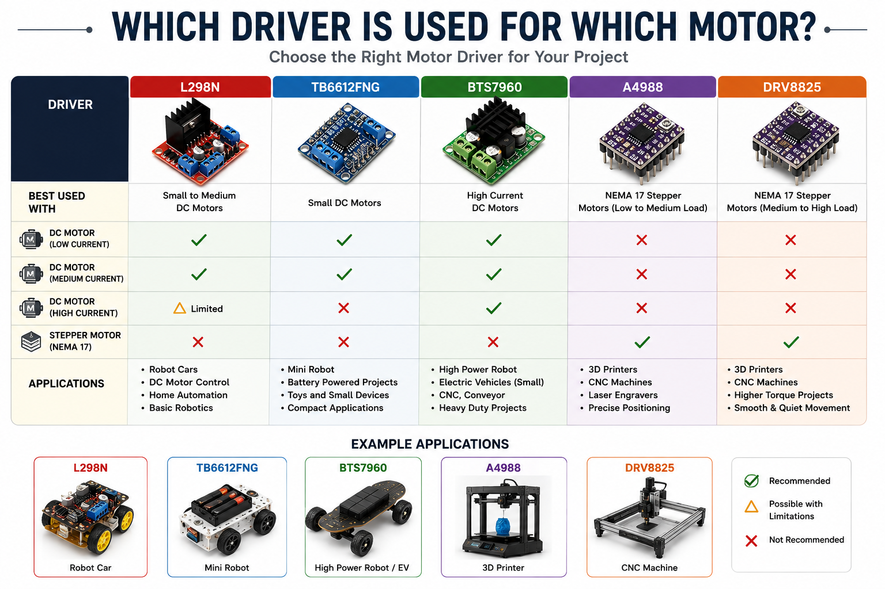

# Arduino Motor Driver Comparison: L298N vs TB6612FNG vs BTS7960 vs A4988 vs DRV8825


A complete comparison guide covering the most popular Arduino motor drivers, including **L298N**, **TB6612FNG**, **BTS7960**, **A4988**, and **DRV8825**.

Whether you're building a **robot car**, **robotic arm**, **CNC machine**, **3D printer**, **conveyor system**, or **industrial automation project**, choosing the correct motor driver is essential for reliable performance.

---

# Table of Contents

- What is a Motor Driver?
- Why Arduino Needs a Motor Driver
- Internal Architecture
- H-Bridge vs Stepper Drivers
- Driver Comparison
- Voltage & Current Comparison
- Arduino Wiring
- Arduino Code Examples
- Driver Selection Guide
- Real Projects
- Specifications
- Advantages & Disadvantages
- FAQs
- Resources

---

# What is a Motor Driver?

A motor driver is an electronic interface between a microcontroller and a motor.

Arduino GPIO pins can only provide a small amount of current, while motors typically require much higher current and voltage. Motor drivers safely deliver power from an external supply while allowing the Arduino to control motor direction and speed.

---

# Internal Architecture


Motor drivers generally fall into two categories:

## H-Bridge Drivers

- L298N
- TB6612FNG
- BTS7960

Designed for:

- DC Motors
- Gear Motors

---

## Stepper Drivers

- A4988
- DRV8825

Designed for:

- NEMA17
- NEMA23
- Bipolar Stepper Motors

---

# Applications



| Project | Recommended Driver |
|----------|-------------------|
| Robot Car | L298N / TB6612FNG |
| Robotic Arm | DRV8825 |
| CNC Machine | DRV8825 |
| 3D Printer | A4988 / DRV8825 |
| Conveyor | BTS7960 |
| Industrial Automation | BTS7960 |

---

# Voltage & Current Comparison


| Driver | Voltage | Continuous Current |
|---------|----------|------------------:|
| L298N | 5V–35V | 2A |
| TB6612FNG | 2.5V–13.5V | 1.2A |
| BTS7960 | 6V–27V | 43A |
| A4988 | 8V–35V | 2A |
| DRV8825 | 8.2V–45V | 2.5A |

---

# Arduino Wiring


Example wiring:

| Arduino | L298N |
|----------|--------|
| D5 | ENA |
| D6 | IN1 |
| D7 | IN2 |
| GND | GND |

---

# Arduino Code Examples

## L298N

```cpp
const int ENA=5;
const int IN1=6;
const int IN2=7;

void setup(){

pinMode(ENA,OUTPUT);
pinMode(IN1,OUTPUT);
pinMode(IN2,OUTPUT);

}

void loop(){

digitalWrite(IN1,HIGH);
digitalWrite(IN2,LOW);

analogWrite(ENA,180);

delay(3000);

}
```

---

## A4988

```cpp
#define STEP_PIN 2
#define DIR_PIN 3

void setup(){

pinMode(STEP_PIN,OUTPUT);
pinMode(DIR_PIN,OUTPUT);

}

void loop(){

digitalWrite(DIR_PIN,HIGH);

for(int i=0;i<200;i++){

digitalWrite(STEP_PIN,HIGH);
delayMicroseconds(800);

digitalWrite(STEP_PIN,LOW);
delayMicroseconds(800);

}

delay(1000);

}
```

---

# Driver Selection Guide


Choose the right driver based on your project:

| Project | Driver |
|----------|---------|
| Beginner Robot | L298N |
| Battery Robot | TB6612FNG |
| High Current Robot | BTS7960 |
| CNC | DRV8825 |
| 3D Printer | A4988 |
| Industrial Machine | BTS7960 |

---

# Real Projects


These drivers are commonly used in:

- Robot Cars
- AGVs
- Robotic Arms
- CNC Machines
- Laser Engravers
- Conveyor Systems
- Pick & Place Machines
- Electric Vehicles

---

# Professional Workspace


A well-organized electronics workspace makes motor driver testing easier and safer.

Recommended tools:

- Arduino Uno
- Breadboard
- Power Supply
- Oscilloscope
- Digital Multimeter
- Jumper Wires
- Soldering Station

---

# Frequently Asked Questions

### Which motor driver is best for beginners?

L298N.

---

### Which driver supports the highest current?

BTS7960 (43A).

---

### Which driver is best for CNC machines?

DRV8825.

---

### Which driver is best for 3D printers?

A4988 and DRV8825.

---

### Which driver is the most efficient?

TB6612FNG.

---

# Learn More

[## 🌐 Chip.pk Complete Article](https://www.chip.pk/blogs/chip-pk-knowledge-hub/arduino-motor-driver-comparison)


# License

MIT License
